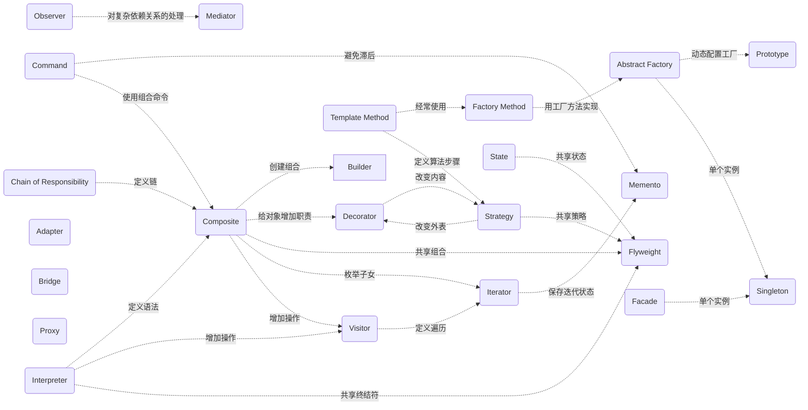

# 设计模式

|  类型  | 序号 | 设计模型     | 代码                                   | 常用 | 简介                                                                                                     | 别名               |
| :----: | ---- | ------------ | -------------------------------------- | ---- | -------------------------------------------------------------------------------------------------------- | ------------------ |
| 创建型 | 1    | 单例模式     | [singleton](./singleton/)              |      | 保证一个类仅有一个实例，并提供一个全局访问点                                                             |                    |
|        | 2    | 工厂模式     | [fatcory](./factory/)                  |      | 创建对象的工厂方法，隐藏了对象的创建细节，使得代码更加灵活和可维护                                       | 简单工厂，工厂方法 |
|        | 3    | 抽象工厂模式 | [abstrct_factory](./abstract_factory/) |      | 提供一个创建一系列相关或相互依赖对象的接口，而无需指定它们具体的类                                       | 工厂族             |
|        | 4    | 建造者模式   | [builder](./builder/)                  |      | 将一个复杂对象的构建过程与其表示分离，使同样的构建过程可以创建不同的表示                                 | 生成器模式         |
|        | 5    | 原型模式     | [prototype](./prototype/)              |      | 通过复制现有对象来创建新对象，从而避免了创建对象时的成本和复杂度                                         | 克隆               |
| 结构型 | 6    | 代理模式     | [proxy](./proxy/)                      |      | 为其他对象提供一种代理以控制对这个对象的访问                                                             | 委托，句柄         |
|        | 7    | 桥接模式     | [bridge](./bridge/)                    |      | 将抽象部分和实现部分分离，使它们可以独立地变化                                                           | 桥梁               |
|        | 8    | 装饰器模式   | [decorator](./decorator/)              |      | 动态地给对象添加额外的职责，以避免使用子类的方式扩展对象的功能                                           | 包装器             |
|        | 9    | 适配器模式   | [adapter](./adapter/)                  |      | 将一个类的接口转换成客户端所期望的另一个接口，以解决接口不兼容的问题                                     | 包装器             |
|        | 10   | 门面模式     | [facade](./facade/)                    |      | 为复杂的子系统提供一个简单的接口，以便外部客户端可以更加容易地使用该系统                                 | 外观模式           |
|        | 11   | 组合模式     | [composite](./composite/)              |      | 将对象组合成树形结构来表示“整体-部分”的层次结构，使得客户端可以以一致的方式处理单个对象和对象组合        | 树形结构           |
|        | 12   | 享元模式     | [flyweight](./flyweight/)              |      | 通过共享对象来减少内存使用和对象创建的开销，提高系统的性能                                               | 轻量               |
| 行为型 | 13   | 观察者模式   | [observer](./observer/)                |      | 在对象之间定义一种一对多的依赖关系，当一个对象的状态发生改变时，所有依赖于它的对象都会得到通知           | 发布-订阅模式      |
|        | 14   | 模板模式     | [template](./template/)                |      | 定义一个算法的骨架，将一些步骤延迟到子类中实现，以便子类可以改变算法的某些特定步骤                       | 模板方法           |
|        | 15   | 策略模式     | [strategy](./strategy/)                |      | 定义一系列算法，将它们封装成独立的策略对象，并使它们可以互相替换                                         | 政策               |
|        | 16   | 职责链模式   | [chain](./chain/)                      |      | 将请求沿着一个对象链进行传递，直到有一个对象处理它为止                                                   | 责任链             |
|        | 17   | 状态模式     | [state](./state/)                      |      | 将一个对象的行为和状态分离，使得对象在不同的状态下具有不同的行为                                         | 状态机             |
|        | 18   | 迭代器模式   | [iterator](./iterator/)                |      | 提供一种访问聚合对象中各个元素的方法，而无需暴露该对象的内部表示                                         | 游标               |
|        | 19   | 访问者模式   | [visitor](./visitor/)                  |      | 将一组操作分离出来，使得可以在不改变对象结构的前提下，定义新的操作                                       | 访问模式           |
|        | 20   | 备忘录模式   | [memento](./memento/)                  |      | 在不破坏封装性的前提下，捕获一个对象的内部状态，并在该对象之外保存这个状态，以便之后可以恢复为原来的状态 | 快照               |
|        | 21   | 命令模式     | [command](./command/)                  |      | 将请求封装成一个对象，从而可以将请求参数化、队列化、记录日志等操作                                       | 动作               |
|        | 22   | 解释器模式   | [interpreter](./interpreter/)          |      | 给定一个语言，定义它的文法的一种表示，并定义一个解释器，使用该解释器来解释语言中的句子                   | 语法分析器         |
|        | 23   | 中介模式     | [mediator](./mediator/)                |      | 通过引入一个中介者对象，来协调和控制对象之间的交互，从而避免对象之间的紧耦合                             | 调停者             |

# 设计模式之间的关系

# 设计原则

| 序号 | 原则                                                    | 内涵                                                            | 备注 |              |
| ---- | ------------------------------------------------------- | --------------------------------------------------------------- | ---- | ------------ |
| 1    | 单一职责原则（Single Responsibility Principle）         | 一个类只负责一项职责                                            | SRP  |              |
| 2    | 开闭原则（Open Closed Principle）                       | 对扩展开放,对修改关闭                                           | OCP  |              |
| 3    | 里氏替换原则（Liskov Substitution Principle）           | 任何基类可以出现的地方,子类一定可以出现                         | LSP  |              |
| 4    | 迪米特法则（Law of Demeter）                            | 一个实体应当尽量少的与其它实体发生相互作用,使得功能模块相互独立 | LOD  | 最少知识法则 |
| 5    | 接口隔离原则（Interface Segregation Principle）         | 使用多个隔离的接口,比使用单个接口要好,降低类之间的耦合度        | ISP  |              |
| 6    | 依赖倒置原则（Dependence Inversion Principle）          | 针对接口编程,依赖于抽象而不依赖于具体                           | DIP  |              |
| 7    | 合成聚合复用原则（Composite/Aggregate Reuse Principle） | 尽量使用合成/聚合的方式,而不是使用继承                          | CARP |              |
